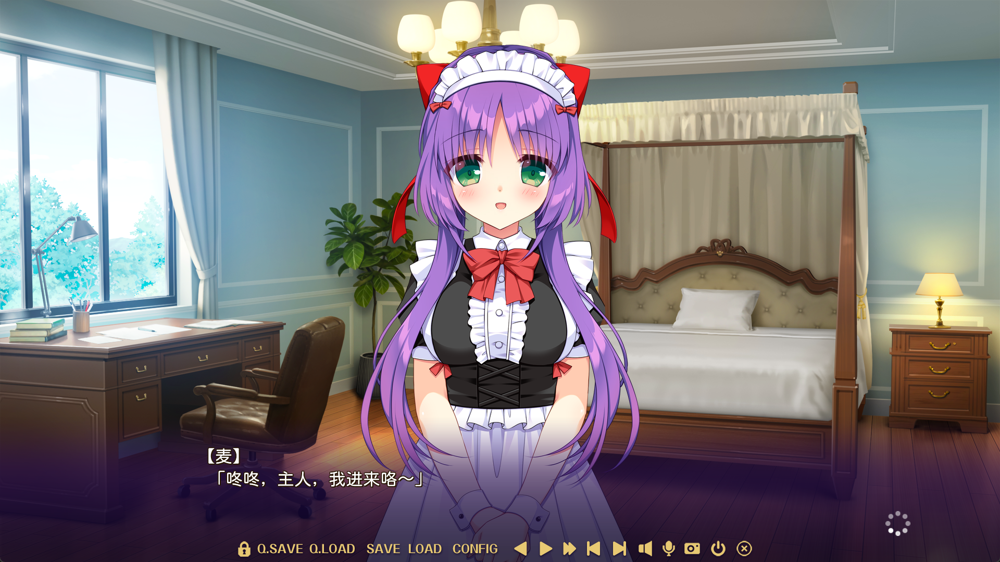

这个仓库发布我使用 GPT-5.6 Sol 制作的, 某个 "发售于 2026 年 9 月 25 日的游戏" 的汉化补丁.

## 注意事项

本补丁仅作语言交流学习之用. 在本仓库之外传播或录制本补丁内容的行为与补丁作者无关, 后果自负. **严禁将本补丁或其制品用于盈利目的.**

## 使用方法

### Windows 桌面端

在仓库的 Releases 下载最新的 `patch.xp3`, 放在游戏目录下, 与启动程序和 `data.xp3` 位于同一文件夹.

### Android 移动端

以 [Tyranor 模拟器](https://www.tyranoremu.com/) 为例, 你可以将游戏的全部资源文件打包为单个 `data.xp3`, 然后在仓库的 Releases 下载最新的 `patch.xp3`, 将这两个文件放在同一目录下, 使用 Tyranor 模拟器打开这个目录, 启动 `data.xp3` 即可.

## Q & A

Q: 这个补丁使用的是什么字体? 怎么切换字体?  
A: 所有文字默认使用 [寒蝉全圆体](https://github.com/Warren2060/ChillRound/releases/tag/v3.200) 显示. 如果你使用 Windows 桌面端游玩, 可以在游戏设置切换正文字体. Android 模拟器则一般不支持切换字体.

Q: 游玩时出现补丁导致的游戏崩溃 / 报错 / 非预期的显示错误, 或者发现翻译错误 / 有翻译修改建议, 怎么办?  
A: 你可以在仓库的 Issues 反馈. 对于技术性问题, 请给出尽量详细的操作说明, 错误信息的日志或截图, 你可以参考[这篇文章](https://www.chiark.greenend.org.uk/~sgtatham/bugs-cn.html); 对于翻译修改建议, 请以至少一句翻译作为例子, 给出游戏截图和场景编号, 说明修改的理由.

## 更新日志

### 2026-09-25 v0.1

完成 UI 和剧本文字的初步翻译.

### 2026-09-25 v0.2

- 修复选择肢标签名导致跳转报错的问题.
- 添加 11 个特典宣传场景, 点击 "回想" 页面的最后一个路线以观赏.
- 主播模式: 将 [patch2-streaming.xp3](https://github.com/para1lel/ousama/releases/download/v0.2/patch2-streaming.xp3) 放置于游戏目录, 重命名为 `patch2.xp3`.
  - 它将 53 张 CG 及其 570 张变体覆盖为黑图, 并且隐藏裸体立绘.
- 校对模式: 将 [patch2-bilingual.xp3](https://github.com/para1lel/ousama/releases/download/v0.2/patch2-bilingual.xp3) 放置于游戏目录, 重命名为 `patch2.xp3`.
  - 它在左上角同步显示日文原文的台词和独白.
